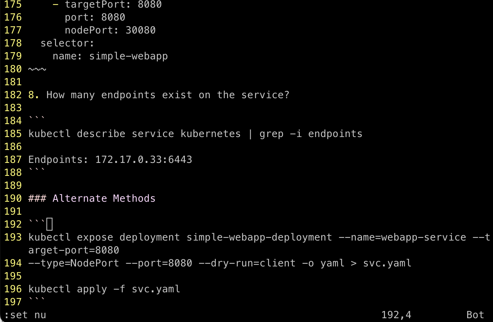

# Vim Quick Reference

## Modes

There are four (4) modes in the vim/vi editor:

- Normal
- Insert
- Visual
- Replace

### Normal

The vim/vi editor is in *normal*  mode upon entering. Editing is not allowed in this mode. 
The alpha-numeric keys act as navigation keys for moving around the document.

- h - moves one position to the left (same as &larr;)
- j - moves one position down (same as &darr;)
- k - moves one position up (same as &uarr;)
- l - moves one position to the right (same as &rarr;)

There are times when moving a single character at a time is not fast enough. In these cases,
you can use *motion* keys

- w - word: Words are delineated by spaces; however, special characters are also recognized as separate words. The *w* motion key takes you to the beginning (first character) of the next word.
- W - word: Special characters are not recognized as delimiters; otherwise, similar to *w* motion key.
- e - end: The delimiter characters include the space and special characters, but the cursor is placed at the last character 
of the current word.
- E - end: Special characters are not recognized as delimiters; otherwise, similar to *e* motion key.
- b - back: Takes the cursor back to the beginning of the previous word. Special characters are considered a separate word.
- B - back: Takes the cursor back to the beginning of the previous word, ignoring special characters. Special characters are considered NOT a separate word.
- $ - end of line: Places the cursor at the end of the current line.
- 0 - beginning of line: Places the cursor at the beginning of the current line.
- G - eof: Places the cursor at the end of file.
- gg - bof: Places the cursor at the beginning of file.

#### Including Numeric Keys
You can combine numeric values with the above *motion* keys, i.e., 5 + j will take you down five lines. 
This makes navigation very quick compared to moving a single word or line at a time. Also,
you can jump to a specific line number by pressing : + <line_number>, i.e., **:25** will take you to the
25th line in the file.

#### Display Line Numbers
It is useful sometimes to display line numbers. This is accomplished by pressing : + set nu, i.e., **:set nu**

### Insert

Editing is performed in the *insert* mode.

### Visual

You select text via the keyboard without the need for using an external device such as a mouse.

### Replace

In this mode, you are able to find and replace text.

## Navigation

## Editing

## Save/Exit

## References

[[1] Vim Crash Course | How to edit files quickly in CKAD/CKA exam, https://www.youtube.com/watch?v=knyJt8d6C_8](https://www.youtube.com/watch?v=knyJt8d6C_8)