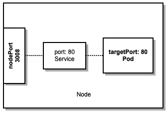

# Services

## Service Types

- NodePort
- ClusterIP
- LoadBalancer

## NodePort
Acts as a virtual server inside the node. It connects requests from the outside world to
pods inside the node.

**service-definition.yaml**

~~~yaml
apiVersion: v1
kind: Service
metadata: 
  name: myapp-service
spec:
  type: NodePort
  ports:
  - targetPort: 80
    port: 80
    nodePort: 30008
  selector:
    app: myapp
    type: front-end
~~~



- **nodePort** (Optional) is the port that is exposed at the node-level to the outside world. It has
a valid range from 30000 to 32767. This is an optional field. If not supplied, then a random
value in the valid range is automatically selected by k8s.

- **port** (Required) is the service's port that sits between the *nodePort* and the *targetPort* 
on the pod.

- **targetPort** (Optional) is the port exposed on the pod. In no value is supplied, then its
value is assumed to be the same as port.

Use `selector` to specify the pod(s) that is targeted. Pods with a label matching the selector
type will be connected.

``` 
kubectl create -f service-definition.yaml
```

``` 
kubectl get services
```

``` 
curl http://192.168.1.2:3008

Response...
```

## ClusterIP

Acts as an abstracted endpoint to hide the implementation details such as pod IP addresses 
from consuming services.

~~~yaml
apiVersion: v1
type: Service
metadata: 
  name: backend
spec:
  type: ClusterIP
  ports: 
  - targetPort: 80
    port: 80
  selector:
    app: myapp
    type: backend
~~~

## LoadBalancer

## Lab Solution

1. How many Service exist on the system?

    ``` 
    controlplane ~ ➜  alias k=kubectl
    
    controlplane ~ ➜  k get svc
    NAME         TYPE        CLUSTER-IP   EXTERNAL-IP   PORT(S)   AGE
    kubernetes   ClusterIP   10.43.0.1    <none>        443/TCP   5m18s
    
    controlplane ~ ➜  k get services
    NAME         TYPE        CLUSTER-IP   EXTERNAL-IP   PORT(S)   AGE
    kubernetes   ClusterIP   10.43.0.1    <none>        443/TCP   5m25s
    ```

2. This service is the default service created by k8s. What is the service type?

    ```
    ClusterIP
   ```

3. What is the targetPort configured on the k8s service?

    ``` 
    controlplane ~ ➜  k get svc kubernetes -o yaml | grep -iC 4 targetPort
      ports:
      - name: https
        port: 443
        protocol: TCP
        targetPort: 6443
      sessionAffinity: None
      type: ClusterIP
    status:
      loadBalancer: {}
    ```

4. How many labels are configured on the k8s service?

    ``` 
    controlplane ~ ➜  k get svc kubernetes -o yaml | grep -iC 3 labels:
    kind: Service
    metadata:
      creationTimestamp: "2022-05-13T14:28:27Z"
      labels:
        component: apiserver
        provider: kubernetes
      name: kubernetes
    ```

5. How many deployments exist on the system?

    ``` 
    controlplane ~ ➜  k get deployments --no-headers | wc -l
    1
    ```

6. What image used to create the pods in the deployment?

    ``` 
    controlplane ~ ➜  k get deployment simple-webapp-deployment -o yaml | grep -iC 5 image
          creationTimestamp: null
          labels:
            name: simple-webapp
        spec:
          containers:
          - image: kodekloud/simple-webapp:red
            imagePullPolicy: IfNotPresent
            name: simple-webapp
            ports:
            - containerPort: 8080
              protocol: TCP
            resources: {}
    ```

7. Create a new service to access the web application using the service-definition-1.yaml file

    - Name: webapp-service
    - Type: NodePort
    - targetPort: 8080
    - port: 8080
    - nodePort: 30080
    - selector:
    - name: simple-webapp

    #### service-definition-1.yaml
    
    ~~~yaml
    apiVersion: v1
    kind: Service
    metadata:
      name: webapp-service
    spec:
      type: NodePort
      ports:
        - targetPort: 8080
          port: 8080
          nodePort: 30080
      selector:
        name: simple-webapp
    ~~~

8. How many endpoints exist on the service?

    ``` 
    kubectl describe service kubernetes | grep -i endpoints
    
    Endpoints: 172.17.0.33:6443
    ```

### Alternate Methods

``` 
kubectl expose deployment simple-webapp-deployment --name=webapp-service --target-port=8080
--type=NodePort --port=8080 --dry-run=client -o yaml > svc.yaml

kubectl apply -f svc.yaml
```